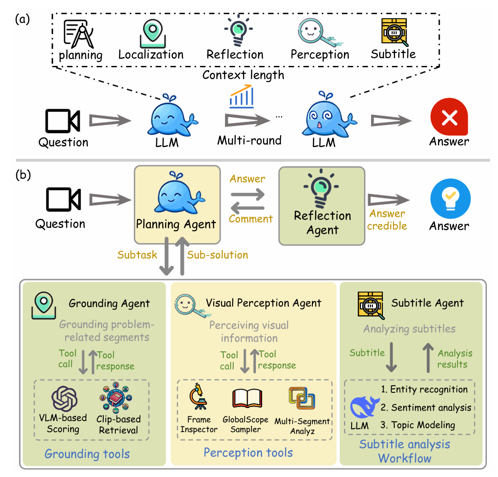

# Symphony: A Cognitively-Inspired Multi-Agent System for Long-Video Understanding

[](https://arxiv.org/abs/2603.17307) 
[](https://github.com/Haiyang0226/Symphony)
[](LICENSE)

**Symphony** is a cognitively-inspired multi-agent system designed to tackle the challenges of **Long-Form Video Understanding (LVU)**. By emulating human cognition patterns, Symphony decomposes complex LVU tasks into fine-grained subtasks and incorporates a deep reasoning collaboration mechanism enhanced by reflection.

## 📖 Introduction

Long-form video understanding is critical for applications like sports commentary, intelligent surveillance, and film analysis. However, existing Multimodal Large Language Model (MLLM) agents struggle with high information density and extended temporal spans. Simple task decomposition and retrieval-based methods often lose key information or fail at complex reasoning.

Symphony addresses these limitations through:
1.  **Cognitive Task Decomposition:** Specialized agents for planning, grounding, perception, and language.
2.  **Reflection-Enhanced Collaboration:** A dynamic mechanism that evaluates and refines reasoning chains.
3.  **VLM-Based Grounding:** Precise localization of video segments using LLM query expansion and VLM relevance scoring.

## 🚀 Key Features

- **Cognitively-Inspired Architecture:** Decouples reasoning capabilities into functional dimensions (Planning, Reflection, Grounding, Subtitle, Visual Perception) to reduce cognitive load on individual models.
- **Dynamic Collaboration:** Uses a reflection-enhanced dynamic reasoning framework (inspired by Actor-Critic) to iteratively refine solutions based on critique.
- **Advanced Grounding:** Leverages LLMs for query decomposition and VLMs for semantic relevance scoring, handling abstract concepts and multi-hop reasoning better than traditional CLIP-based retrieval.
- **State-of-the-Art Performance:** Achieves superior results on major LVU benchmarks including LVBench, LongVideoBench, VideoMME, and MLVU.

## 🏗️ Framework Architecture

Symphony consists of five specialized agents orchestrated by a central planning mechanism:

1.  **Planning Agent:** Central coordinator responsible for global task planning, multi-agent scheduling, and answer generation.
2.  **Reflection Agent:** Evaluates the reasoning trajectory. If logical inconsistencies or insufficient evidence are detected, it generates critiques to initiate refinement.
3.  **Grounding Agent:** Identifies relevant video segments using either VLM-based scoring or CLIP-based retrieval, depending on query complexity.
4.  **Subtitle Agent:** Analyzes textual subtitles for entity recognition, sentiment analysis, and topic modeling.
5.  **Visual Perception Agent:** Conducts multi-dimensional visual perception using tools like frame inspector, global summary, and multi-segment analysis.


*(Figure: The reflection-enhanced dynamic reasoning framework in Symphony.)*

## 📊 Performance

Symphony achieves state-of-the-art performance across four representative LVU datasets.

| Method | LVBench | LongVideoBench (Val) | Video MME (Long) | MLVU |
| :--- | :---: | :---: | :---: | :---: |
| **Commercial VLMs** | | | | |
| Gemini-1.5-Pro | 33.1 | 64.0 | 67.4 | - |
| GPT-4o | 48.9 | 66.7 | 65.3 | 54.9 |
| **VLMs** | | | | |
| Seed 1.6 VL | 58.1 | 66.1 | 68.4 | 65.3 |
| **Agent Based** | | | | |
| DVD | 66.8 | 67.2 | 61.5 | - |
| VideoDeepResearch | 55.5 | 70.6 | 76.3 | 64.5 |
| **Ours (Symphony)** | **71.8** | **77.1** | **78.1** | **81.0** |

*On the challenging LVBench, Symphony surpasses the prior state-of-the-art method by **5.0%**.*


## 📦 Installation & Usage

1.  **Clone the repository:**
    ```bash
    git clone https://github.com/Haiyang0226/Symphony.git
    cd Symphony
    
    ```

2.  **Install dependencies:**
    ```bash
    conda env create -f environment.yml
    conda activate sym
    ```

3.  **Configure API Keys:**
    Ensure you have access to the required models (DeepSeek, Seed VL, etc.) and configure your API keys in the `config.yaml` file.

4.  **Prepare frames,subtitles:**  
   Download the subtitles in ./databse/subtitles/  
   Download the videos in ./databse/videos/. To sample the frames, run  
   ```bash
   video2frames.py
   ```
5.  **Run Inference:**
    ```bash
    python run_single.py
    ```

## 📝 Citation

If you find Symphony useful in your research, please consider citing our paper:

```bibtex
@article{yan2026symphony,
  title   = {Symphony: A Cognitively-Inspired Multi-Agent System for Long-Video Understanding},
  author  = {Yan, Haiyang and Zhou, Hongyun and Xu, Peng and Feng, Xiaoxue and Liu, Mengyi},
  journal = {arXiv preprint arXiv:2603.17307},
  year    = {2026},
  eprint  = {2603.17307},
  archivePrefix = {arXiv},
  primaryClass  = {cs.CV}
}
```

## 🤝 Acknowledgements

This work was done during an internship at **Kuaishou Technology**. We thank the contributors and the open-source community for their valuable tools and datasets.

## 📄 License

This project is licensed under the MIT License - see the [LICENSE](LICENSE) file for details.

---
